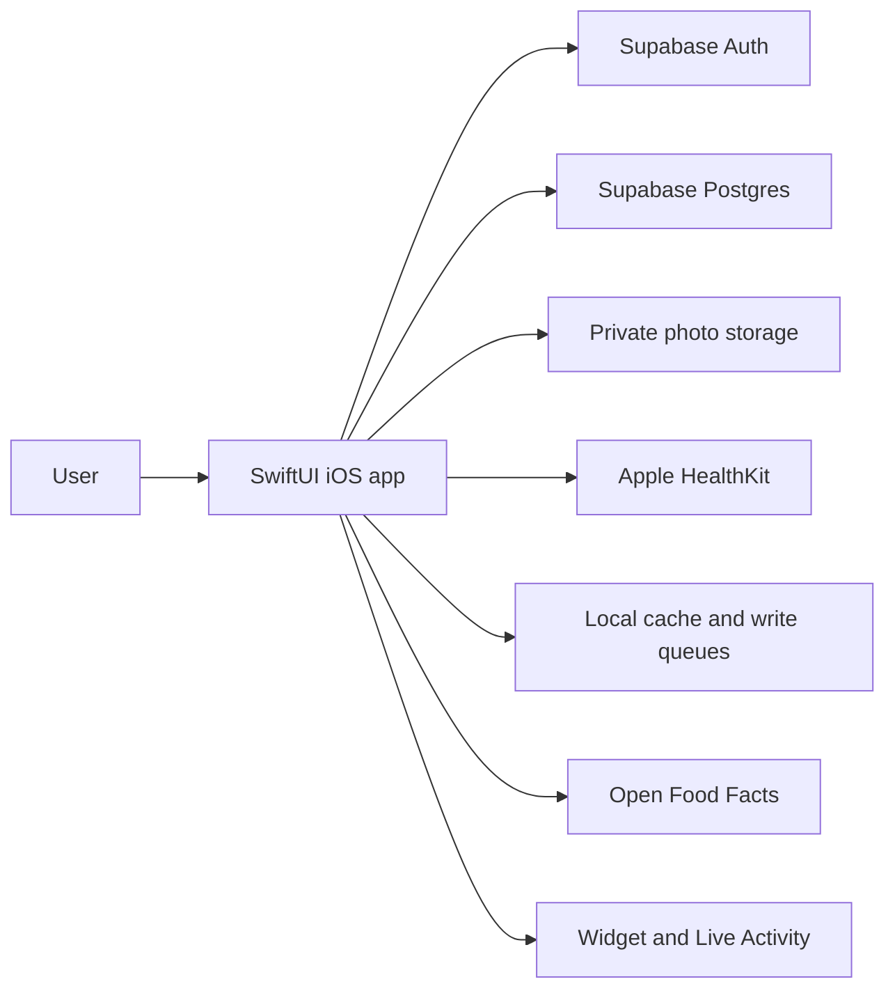

# Fitness Tracker: product and roadmap

## Product intent

Fitness Tracker is a personal record of training, nutrition, and health trends that should remain useful for decades. It brings the user's own logs and selected Apple Health data into one place. The user remains in control of their records and decisions. The app supports tracking and reflection; it is not a diagnostic or medical treatment system.

V1 is the trustworthy foundation: accurate records, understandable calculations, private data, safe corrections, and recoverable backups. V2 adds useful, carefully bounded assistance without making the core app depend on AI.

## What the app supports today

The iOS app includes:

- **Training:** exercise catalog, routines, in-progress strength sessions, set history/progression, supersets, cardio, running plans/routes, gyms, injuries, timers, widget and Live Activity support.
- **Nutrition:** food search and barcode/label workflows, meals and quantities, recipes/meal prep, saved meals/days, treats, calorie/macro tracking, and legacy daily-total history.
- **Progress and wellbeing:** goals/phases, weight and body measurements, progress photos, daily and weekly check-ins, adherence and weekly insights, hydration/caffeine, steps and sleep. Current photo uploads use Supabase Storage; the V1 release decision is to remove cloud photo uploads and either keep files on-device only or remove the photo feature.
- **Integrations:** Supabase Auth/Postgres/Storage; selected, read-only Apple Health data; Open Food Facts lookup; selective offline caches and queued writes.

This is an iOS app with a widget and Live Activity extension. The repository does not currently define a web/Android client, coach portal, or watchOS companion app. Check the code before relying on any feature name in older briefs.

## Main user journeys

1. Sign in, review today's dashboard, and complete a daily or weekly check-in.
2. Plan a routine, record strength/cardio/running sessions, and review prior performance.
3. Search or scan foods, record portions by meal, prepare reusable recipes/meals, and review daily nutrition.
4. Track weight, measurements, photos, sleep, steps, hydration, and other selected signals over time.
5. Use supported features with intermittent network access, then sync queued changes when connectivity returns.
6. Correct old entries and understand how the correction changes weekly summaries and estimates.

## System design

The client talks directly to Supabase using the public anon/publishable key and the signed-in user's session. RLS is the backend ownership boundary. Migrations describe 43 application tables across training, nutrition, health/progress, and preferences. Views/RPCs provide some aggregates. Progress photos use a private Storage bucket and expiring signed URLs. HealthKit is read-only in the inspected implementation.

The app separates SwiftUI views, view models, data/domain models, repositories, and service/calculation code. Offline behavior is selective, not a full local database. Queued writes and caches must be treated as sensitive user data and remain bound to the account that created them.

## V1 scope and principles

- Protect each user's rows, child records, photos, and routes from other accounts.
- Make source and confidence visible: manually entered, imported, cached, or calculated values should not be confused.
- Preserve the values the user actually logged when a catalog item later changes; make corrections explicit.
- Keep calendar dates and timestamps consistent across local time, HealthKit, and server summaries.
- Make calculations deterministic, explainable, testable, and separate from presentation.
- Provide recovery, export/deletion, migration, and backup expectations before opening the app to other users.
- Do not ship user progress-photo uploads to Supabase. V1 photos must be local-only with strong file protection and no backup copy, or the photo feature must be removed.
- Keep setup and release reproducible; do not rely on undocumented production dashboard changes.

See [V1 release checklist](V1_RELEASE_CHECKLIST.md) for current release gates.

## V2: opt-in LLM assistance

The desired direction is an in-app assistant that can explain the user's own progress and help navigate the app. Ship it in stages, starting read-only. A strong first release is an opt-in weekly reflection grounded in a user-selected date range, with source dates/metrics, missing-data caveats, and a clear distinction between recorded facts and generated interpretation.

### Design rules

- Call the model only from an authenticated server-side endpoint (such as a Supabase Edge Function). Never include provider credentials in the iOS app.
- Fetch only the minimum date-bounded data required. Do not send full history, photos, or precise route data by default.
- Keep exact calculations in deterministic app/backend code; give the assistant calculated values and provenance rather than asking it to do arithmetic.
- Treat user text, food catalog values, and model output as untrusted. Use constrained structured output, rate/cost/size limits, safe rendering, and evaluation for prompt injection and unsafe advice.
- Make AI use optional and explain what data leaves the app/backend boundary. Label generated text, cite the source period/metrics, surface uncertainty, and retain a non-AI path.
- The first version must not write to health, nutrition, goals, or workout records. Later proposals may use a small allowlisted set of read tools. Any mutation must be previewed and explicitly confirmed by the user.
- Define provider retention/training settings, deletion, regional processing, and incident handling before release. Avoid logging raw health prompts/responses by default.

### Broader roadmap, after V1

1. **Reliability and codebase health:** close V1 release findings; add focused tests around calculations, ownership policies, migrations, and offline replay; remove verified dead code and duplicate mechanics without collapsing distinct domain models.
2. **Training and progress insight:** make data completeness visible beside adherence; add longitudinal comparisons and surface collected weekly check-in responses; improve trend and phase context. Decide score weights only with clear product rationale.
3. **HealthKit-informed estimates:** evaluate longer recency-weighted TDEE windows and optional confidence-weighted Watch energy. First measure data completeness and disagreement; never present the resulting estimate without explaining sources and uncertainty.
4. **Nutrition planning:** build deterministic macro-budget/menu suggestions from the in-house food catalog. Exact numeric matching is a solver/search problem; an LLM may explain options but should not replace deterministic calculation.
5. **Apple Watch:** consider importing workouts and writing app workouts to HealthKit before deciding whether a separate watchOS training experience is worth its support cost.
6. **Other ideas in the archived briefs:** richer check-in/photo history, further HealthKit signals, exercise visualizations, and coaching-style reflection. Revalidate user value and privacy cost before scheduling.

## Superseded approaches

Automated MyFitnessPal diary import was investigated and abandoned; the current direction is in-app nutrition logging. The archive retains the investigation and design evolution, including superseded one-off data-cleanup proposals. Do not execute an archived SQL proposal without checking the current data and obtaining explicit product intent.
