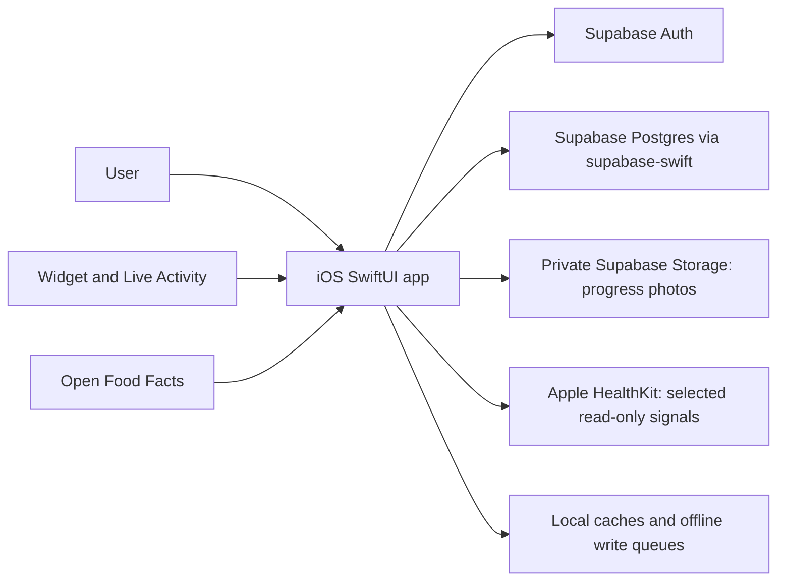

# System design

## Runtime shape

The app is organized around SwiftUI views, view models, Codable domain/data models, and repository/service types. Supabase is accessed directly from the iOS client using the public anon/publishable key and the user's Auth session. Row Level Security (RLS) is therefore a critical authorization boundary, not an optional extra. HealthKit is currently read-only from the app; progress photos are uploaded to a private bucket and read through expiring signed URLs.

## Data domains

Migrations define 43 application tables across these groups:

- **Training:** exercises, routines, routine days/exercises, workouts, workout exercises/sets, cardio sessions, injuries, gyms, running plans/runs/routes, exercise notes, progression and volume views.
- **Nutrition:** foods, meal slots/entries, recipes/ingredients, saved meals/days, meal preps, food groups, planned treats, legacy daily nutrition totals.
- **Health and progress:** weight, body measurements, sleep, steps, daily/weekly check-ins, TDEE estimates, water logs/containers, HealthKit workout dismissals, progress-photo metadata.
- **Preferences and scheduling:** user preferences and weekly schedule.

The schema diagram attached by the user is a useful visual reference, but migrations are the source of truth. Each numbered migration is append-only history; inspect all migrations in sequence, not only the latest snapshot.

## Data ownership and access

Most user-owned records have a `user_id` and RLS policies comparing it with `auth.uid()`. Related child collections generally use an ownership lookup through their parent. Shared catalog tables (exercises/foods) have different policies. The foods policy intentionally permits authenticated users to insert Open Food Facts rows into the shared catalog; validate abuse limits and data quality before opening the app to a wider audience. The progress-photo bucket is private and paths are scoped to the authenticated user's UUID.

## Offline and synchronization

Offline support is partial and feature-specific: local reference caches and persistent queues exist for selected meal, workout, check-in, and water operations. Queues replay writes after reconnect. The design must preserve idempotency, ordering, conflict behavior, account separation, and retry observability. This is not a full local replica; every screen must communicate stale/cache/queued states accurately.

## Key invariants to preserve

- Every private row and object is inaccessible to another authenticated user, including nested child rows and storage objects.
- Historical meal entries should preserve the nutrition snapshot the user logged when catalog foods later change; verify current implementation and migrate if it instead recomputes silently.
- Aggregates must use consistent date/time-zone semantics, especially where a calendar `date` coexists with timestamps and HealthKit samples.
- Derived calculations (TDEE, trends, adherence, weekly totals) must be explainable, reproducible, and protected by fixtures/tests before refactoring.
- Migrations must apply from an empty database and upgrade a representative existing database without data loss.

## Scaling path

For a personal workload, direct client-to-Supabase access is a reasonable simple architecture. Before adding users or an LLM, measure query latency, row counts, sync retries, and storage use. Add indexes for observed filters/orderings and cursor pagination before broadening history queries. Introduce server-side functions only for operations requiring trusted secrets, cross-row transactions, rate limiting, or sensitive orchestration. Keep LLM calls server-side; do not ship provider credentials in the client.
